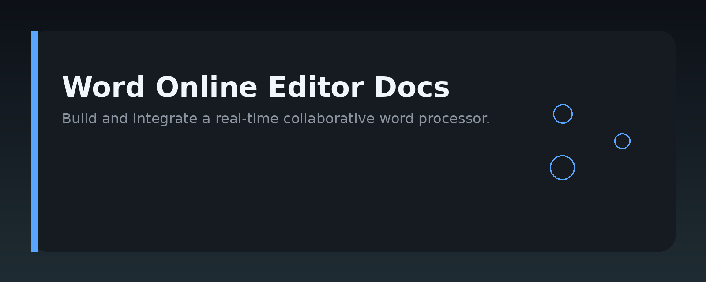
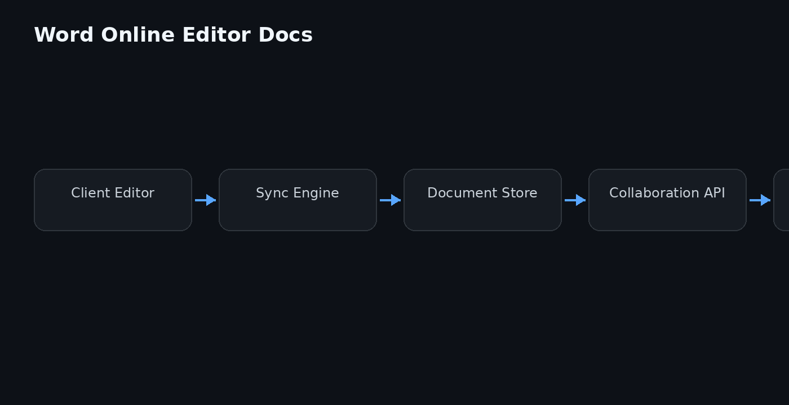

# Word Online Editor Documentation




## Overview

Word Online Editor is a lightweight, browser-based document editor that lets you create, edit, and format text documents without installing desktop software. It runs entirely in the browser, supports real-time collaboration, and stores documents in the cloud or on your own server. This repository documents the architecture, core concepts, and practical usage of the editor, along with code examples for embedding and extending it.

## Why it exists

Most document editing tools fall into two extremes: full desktop suites that are heavy to install, or simple text areas that lack formatting. Word Online Editor fills the gap by providing a familiar word-processing experience directly in the web browser. It exists to solve three specific problems:

- **Accessibility** – Open and edit documents from any device with a modern browser, no installation required.
- **Collaboration** – Multiple users can work on the same document simultaneously, with live cursors and change tracking.
- **Integration** – Developers can embed the editor into existing web applications, CMSs, or internal tools without rebuilding document handling from scratch.

The project focuses on the core editing loop — typing, formatting, saving, and sharing — rather than replicating every feature of a desktop word processor.

## Core concepts

- **Document** – The main data structure. A document contains paragraphs, inline styles, images, and metadata such as title and author.
- **Blocks** – Top-level content units (paragraph, heading, list, table, image). Every block has a type and a set of properties.
- **Inline formatting** – Applied within a block: bold, italic, underline, links, and code spans. Stored as ranges rather than per-character flags.
- **Selection** – The current cursor position or highlighted range. The editor tracks selection to apply formatting and to synchronize collaboration.
- **Operations (Ops)** – Atomic changes like insert text, delete range, or apply style. Every edit is represented as an op, which enables undo, redo, and collaborative merging.
- **Cursors** – Remote users' selection indicators. Sent over the collaboration channel and rendered as colored markers.
- **Persistence** – Documents are saved as JSON or Markdown. The default backend stores files on disk, but any storage adapter can be plugged in.
- **Undo/Redo stack** – A history of ops. Undo reverses the last op, redo reapplies it.

## Architecture

The editor follows a client–server model with a clear separation between the editing engine and the UI.

```
Browser (client)
  └─ Editor UI (React/Vue/vanilla)
       └─ Editor Engine (pure JS, no DOM)
            ├─ Document model
            ├─ Ops pipeline
            └─ Collaboration client
                └─ WebSocket / HTTP sync
Server
  └─ Sync server (Node.js)
       ├─ Op log
       ├─ Document store
       └─ Presence hub (cursors)
```

- **Editor Engine** – A framework-agnostic module that holds the document state and applies ops. It does not touch the DOM; it emits change events and receives commands.
- **Editor UI** – Renders the document, handles keyboard and mouse input, and calls the engine. It also renders remote cursors and selection highlights.
- **Sync server** – Receives ops from all clients, applies them to the canonical document, and broadcasts them to other connected clients. It uses a simple last-write-wins strategy with conflict resolution via op ordering.
- **Storage adapter** – A pluggable interface for saving documents. The default adapter writes JSON files to a local directory; a database adapter is also provided.

The client and server communicate over WebSocket for real-time collaboration, with a REST fallback for one-off saves and document loading.

## Practical workflow

A typical session with Word Online Editor looks like this:

1. **Load a document** – The client requests the document from the server (by ID or path). The server returns the JSON document and the current op log.
2. **Edit locally** – The user types or applies formatting. Each edit generates an op, which is applied to the local engine immediately and queued for sending.
3. **Sync** – The client sends batched ops to the server over WebSocket. The server applies them, updates the document, and broadcasts the ops to other connected clients.
4. **Receive remote changes** – Other clients apply the incoming ops to their local engines and re-render the affected blocks.
5. **Save** – The user clicks Save (or autosave triggers). The client sends the full document snapshot, or the server persists the accumulated op log to storage.
6. **Close** – The client disconnects. The server keeps the document and op log for the next session.

For embedding, the editor exposes a single mount function that takes a container element, an initial document, and a callback for change events.

## Examples

### Embed the editor in a web page

```html
<!DOCTYPE html>
<html>
<head>
  <script src="word-online-editor.js"></script>
</head>
<body>
  <div id="editor-container"></div>
  <script>
    const editor = WordOnlineEditor.mount({
      container: document.getElementById('editor-container'),
      initialDocument: { blocks: [{ type: 'paragraph', text: 'Hello world' }] },
      onChange: (doc) => console.log('Document changed', doc)
    });
  </script>
</body>
</html>
```

### Create a document programmatically

```js
const doc = {
  title: 'Meeting notes',
  blocks: [
    { type: 'heading', level: 1, text: 'Q3 Planning' },
    { type: 'paragraph', text: 'Discuss roadmap for the next release.' },
    { type: 'list', items: ['Finalize API', 'Write docs', 'Run beta'] }
  ]
};

const editor = WordOnlineEditor.mount({
  container: document.getElementById('editor'),
  initialDocument: doc
});
```

### Apply an inline format

```js
// Bold the selected text
editor.format('bold');

// Insert a link at the cursor
editor.insertLink('https://example.com', 'Example');
```

### Listen for document changes

```js
editor.onChange((doc) => {
  // Autosave every 5 seconds
  clearTimeout(saveTimer);
  saveTimer = setTimeout(() => saveToServer(doc), 5000);
});
```

### Custom storage adapter (server-side)

```js
const { StorageAdapter } = require('word-online-editor-server');

class RedisStorage extends StorageAdapter {
  async load(id) {
    const raw = await redis.get(`doc:${id}`);
    return raw ? JSON.parse(raw) : null;
  }

  async save(id, doc) {
    await redis.set(`doc:${id}`, JSON.stringify(doc));
  }
}

const server = createSyncServer({ storage: new RedisStorage() });
server.listen(3000);
```

## FAQ

**Is Word Online Editor a replacement for Microsoft Word?**  
No. It covers the core editing and formatting workflow, but intentionally omits advanced features like mail merge, macros, and complex page layout. It is designed for lightweight, collaborative web documents.

**How does real-time collaboration work?**  
Every client sends ops to the sync server. The server applies ops in order and broadcasts them. Conflict resolution is simple: ops are applied sequentially, so the last op wins for overlapping edits. For most text editing, this gives predictable results.

**Can I use it offline?**  
The editor engine works offline, but collaboration and persistence require a connection. You can queue ops locally and sync them when the connection returns.

**What formats can I import/export?**  
The native format is JSON. Markdown import/export is built in. Plain text export works as well. There is no built-in DOCX support, but you can convert via a separate pipeline.

**How do I run the server?**  
Install the `word-online-editor-server` package, call `createSyncServer()`, and start it with `listen(port)`. It serves both the API and the static editor assets.

**Is it secure?**  
The server does not implement authentication or authorization by default. For production, put it behind a reverse proxy (like nginx) and add your own auth layer. WebSocket connections should use TLS.

**Can I extend the editor with custom blocks?**  
Yes. Register a custom block type with the engine, provide a render function for the UI, and define how it serializes to JSON. The ops pipeline treats custom blocks like any other.

**Where are documents stored?**  
By default, on the server's local disk as JSON files. You can replace the storage adapter to use a database, object storage, or any other backend.

## License MIT

This project is licensed under the MIT License. You are free to use, modify, and distribute it in your own projects, including commercial ones. See the `LICENSE` file in the repository root for the full license text.